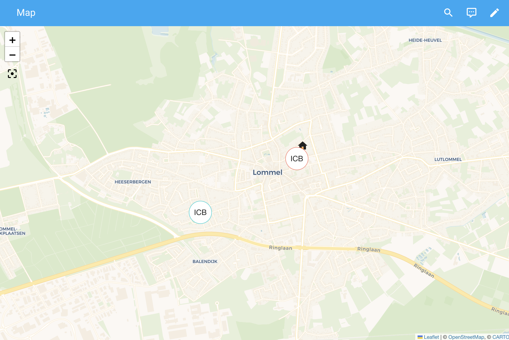

# Home Assistant - Benelux Ice Cream Vans Integration 🍦

This integration for Home Assistant provides a distance sensor using data from various ice cream companies' public APIs.
Whether you're in Belgium or the Netherlands, never miss your favorite ice cream van, or "ijskar", again!

## Supported Ice Cream Companies

### Belgium 🇧🇪

| Company         | City         |
|-----------------|--------------|
| De Kremkerre    | Melle        |
| De Krijmboer    | Lommel       |
| Foubert         | Sint-Niklaas |
| Glace De Bock   | Beveren      |
| Het Boerenijsje | Loenhout     |
| Joris           | Beerse       |
| Pitz            | Stekene      |
| Tartiste        | Deinze       |
| Van De Walle    | Temse        |
| Vanilla +       | Oostende     |

### Netherlands 🇳🇱

| Company        | City     |
|----------------|----------|
| Het Droomijsje | Breskens |

### Coming Soon

- **Luxembourg** 🇱🇺

## How You Can Use It

- **Map**: See where the ice cream vans are located.
- **Automation Trigger**: Set up [Automations](https://www.home-assistant.io/docs/automation/) to alert you
  when the ice cream van is within a certain range.
- **Dashboard**: Keep an eye on your ice cream cravings by adding this sensor to a card on your dashboard.

  
  
  

## Installation

To install the integration to your Home Assistant, use this button:

### Manual Installation

1. Go to HACS > Integrations
2. Add this repo into your HACS [Custom Repositories](https://hacs.xyz/docs/faq/custom_repositories/)
3. Search for "Ice Cream Benelux" and download the latest version of the integration.
4. Restart Home Assistant
5. Configure the integration, see [Configuration](README.md#configuration)

## Configuration

Options for the integration can be set via the user interface, by

1. Go to Settings -> [Devices & Services](https://my.home-assistant.io/redirect/integrations/).
2. In the bottom right corner, click on [Add Integration](https://my.home-assistant.io/redirect/config_flow_start/?domain=ice_cream_benelux).
3. From the list, select "Ice Cream Benelux".
4. Follow the instructions on the screen to configure the integration.

### Configuration Options

| Option      | Description                                                             |
|-------------|-------------------------------------------------------------------------|
| `latitude`  | Latitude of the location to calculate the distance to the nearest van.  |
| `longitude` | Longitude of the location to calculate the distance to the nearest van. |
| `companies` | Ice cream companies to monitor (multiple allowed).                      |

## License

See the LICENSE file in the root of this repository for more info.

Copyright © Studio JW
