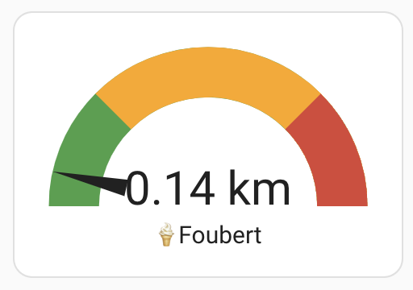

[](https://github.com/studiojw/ice-cream-benelux-ha)
[](https://github.com/studiojw/ice-cream-benelux-ha)
[](https://github.com/studiojw/ice-cream-benelux-ha/issues)
[](https://github.com/studiojw/ice-cream-benelux-ha/blob/main/LICENSE)

# Home Assistant - Benelux Ice Cream Vans Integration 🍦

This integration for Home Assistant provides a distance sensor using data from various ice cream companies' public APIs.

## Supported Ice Cream Companies

### Belgium 🇧🇪

| Company       | City         | configuration.yaml    |
|---------------|--------------|-------------------------|
| De Kremkerre  | Melle        | `de_kremkerre_melle`    |
| Foubert       | Sint-Niklaas | `foubert_sint_niklaas`  |
| Glace De Bock | Beveren      | `glace_de_bock_beveren` |
| Joris         | Beerse       | `joris_beerse`          |
| Pitz          | Stekene      | `pitz_stekene`          |
| Tartiste      | Deinze       | `tartiste_deinze`       |
| Van De Walle  | Temse        | `van_de_walle_temse`    |

### Netherlands 🇳🇱

| Company        | City     | configuration.yaml      |
|----------------|----------|---------------------------|
| Het Droomijsje | Breskens | `het_droomijsje_breskens` |

### Coming Soon

- **Luxembourg** 🇱🇺

## Installation

1. Go to HACS > Integrations
2. Add this repo into your HACS [Custom Repositories](https://hacs.xyz/docs/faq/custom_repositories/)
3. Search for "Ice Cream Benelux" and download the latest version of the integration.
4. Configure the integration, see [Configuration](README.md#configuration)
5. Restart Home Assistant

## Configuration

1. Add the sensor to your [configuration.yaml](https://www.home-assistant.io/docs/configuration/)
2. Make sure to replace:
   - `latitude` with the latitude of your location
   - `longitude` with the longitude of your location
   - `companies` with the company you want to use

```yaml
sensor:
  - platform: ice_cream_benelux
    latitude: 51.12345
    longitude: 4.12345
    companies:
      - name_of_company # See list above (e.g. de_kremkerre_melle)
```

## Examples

### Gauge Card


